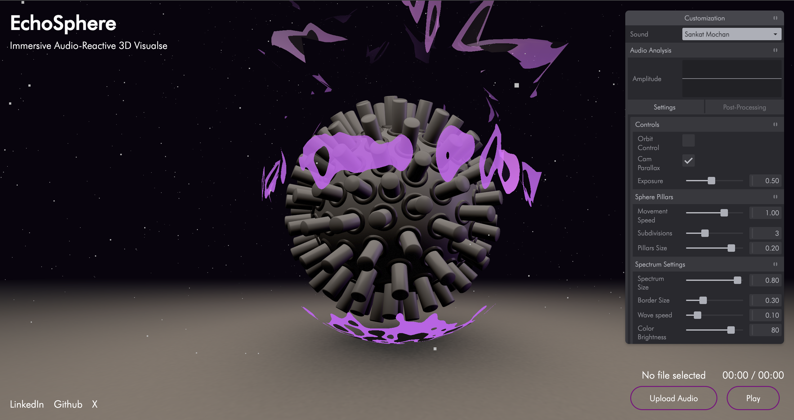

# EchoSphere : Three.js Audio-Visual Experience

This project is an immersive audio-visual experience built using Three.js, featuring a 3D scene with interactive elements that respond to audio input. It includes a particle system, a dynamic sphere pillar structure, a spectrum model with custom shaders, and post-processing effects, all controllable via an intuitive interface.

## Preview


## Features

- **Interactive 3D Scene**: A visually engaging scene with a particle system, a floor model, and a sphere pillar structure that dynamically responds to audio.
- **Audio Reactivity**: The scene reacts to audio input (e.g., music or uploaded audio files) with visual effects like pillar movement and shader animations synchronized to the audio's amplitude.
- **Post-Processing Effects**: Customizable effects including Bloom, RGB Shift, Glitch, Vignette, and Dot Screen, adjustable via a Tweakpane interface.
- **Camera Controls**: Supports both OrbitControls for manual camera navigation and a parallax effect that responds to mouse movement.
- **Audio Analysis**: Real-time audio analysis with a visual amplitude graph and playback controls (play/pause, file upload).
- **Responsive Design**: Adapts to different screen sizes, with a mobile-friendly Tweakpane interface.
- **Custom Shaders**: A spectrum model with custom vertex and fragment shaders for unique visual effects.
- **File Upload**: Users can upload custom audio files to drive the visual experience.
- **Loading Feedback**: A progress bar and loading screen provide feedback during asset loading.

## Tech Stack

- **Three.js**: For rendering and managing the 3D scene.
- **Vite**: Development and build tool for fast bundling and hot module replacement.
- **Tweakpane**: For creating an interactive control panel to adjust scene parameters.
- **GSAP**: Included but not actively used in the provided code (available for animations).
- **Web Audio API**: For audio analysis and playback control.
- **GLTFLoader**: To load 3D models (floor and pillars).
- **vite-plugin-glsl**: For importing and processing GLSL shader files.
- **Post-Processing**: Three.js post-processing effects like UnrealBloomPass, RGBShiftShader, GlitchPass, VignetteShader, and DotScreenShader.

## Installation

Follow these steps to set up and run the project locally:

1. **Clone the Repository**:
   ```bash
   git clone https://github.com/HarshitKumarSahu/3jsEchoSphere.git
   cd 3jsEchoSphere
   ```

2. **Install Dependencies**:
   Ensure you have [Node.js](https://nodejs.org/) installed. Then run:
   ```bash
   npm install
   ```

3. **Run the Development Server**:
   Start the Vite development server:
   ```bash
   npm run dev
   ```
   The app will be available at `http://localhost:5173/` (or another port if specified).

4. **Build for Production**:
   To create a production build:
   ```bash
   npm run build
   ```

5. **Preview the Build**:
   To preview the production build:
   ```bash
   npm run preview
   ```

## Usage

- **Controls**:
  - Use the Tweakpane interface (top-right or bottom-left on mobile) to adjust settings like pillar size, wave speed, post-processing effects, and camera behavior.
  - Toggle between OrbitControls and Parallax camera modes in the "Controls" tab.
  - Select predefined audio tracks or upload a custom audio file via the "Sound" dropdown or file input.
  - Play or pause the audio using the "Play/Pause" button.
  - Monitor audio playback time and amplitude in the "Audio Analysis" section.

- **Assets**:
  - Ensure the `/models` folder contains `floorModel.glb`, `pillarsModels.glb`, and `spectrum.glb`.
  - Ensure the `/textures` folder contains `greyMetel.png` and `blackMetel.png`.
  - Ensure the `/audios` folder contains `SankatMochan.mp3`, `MangalBhawan.mp3`, and `Pachra.mp3`.
  - Place shader files (`vertex.glsl` and `fragment.glsl`) in the `/shaders` folder.

## Project Structure

```
├── public/
│   ├── audios/               # Audio files
│   ├── models/               # 3D models (GLB)
│   ├── textures/             # Texture files
│   ├── futura/               # fonts
│   ├── icons/                # shortcut icon
├── src/
│   ├── shaders/              # GLSL shader files
│   ├── main.js               # Main script
│   ├── style.css             # style sheet
├── package.json              # Project dependencies and scripts
├── vite.config.js            # Vite configuration
└── index.html                # Entry HTML file
```

## Notes

- Ensure all asset paths in `main.js` match your project structure.
- The project requires a modern browser with WebGL and Web Audio API support.
- For production deployment, optimize assets (e.g., compress audio and models) to reduce load times.
- The audio file upload feature creates a temporary URL using `URL.createObjectURL`. Ensure uploaded files are in a supported format (e.g., MP3).

## Contributing

Contributions are welcome! Please submit a pull request or open an issue for bugs, feature requests, or improvements.

## License

This project is licensed under the MIT License.